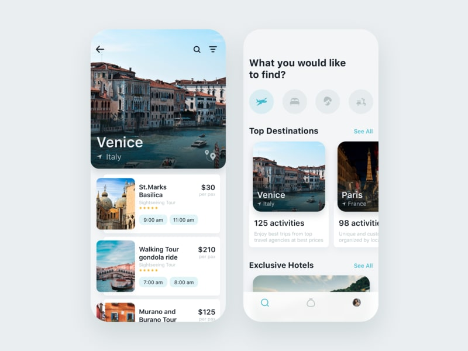
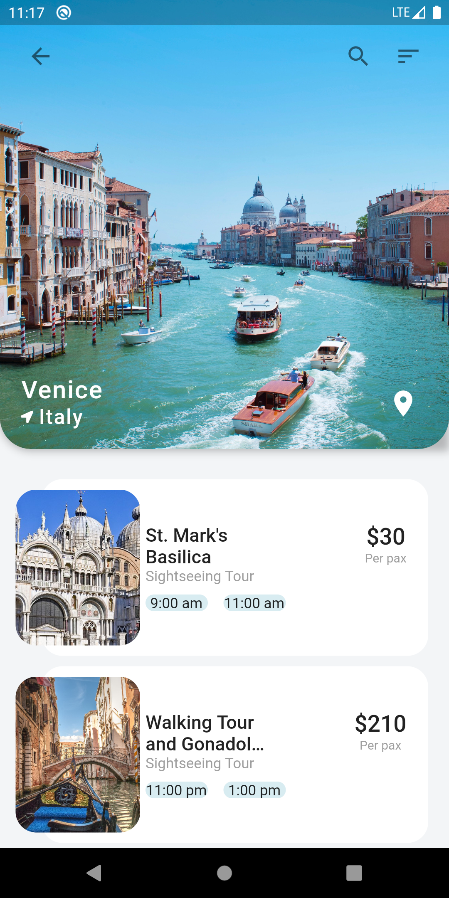
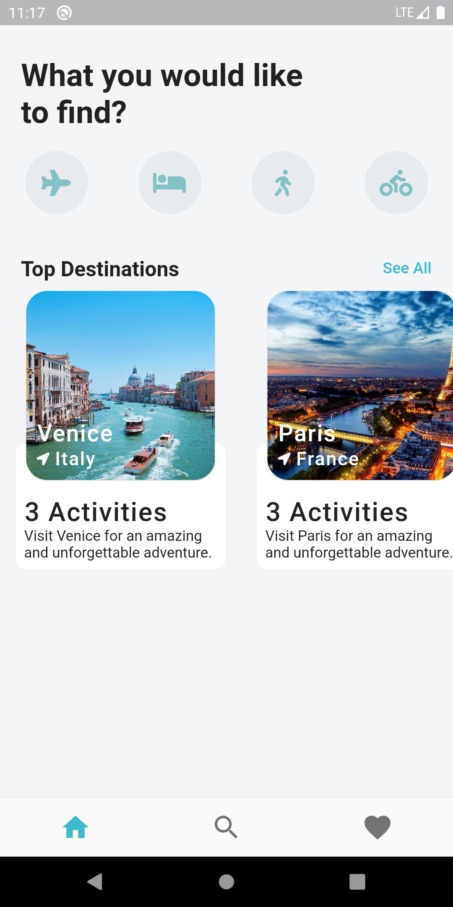

# Travel App Flutter
I found this UI from a YouTube video and decided to code it myself, and then that video was also very helpful I used it as a reference and also as an inspiration.
 
### Languages & tools :
[][android]
[][dart]
[][flutter]
  

|Travel-App Original | Travel-App Home | Travel-App Locations | 
|------|-------|-------|
|||

### Directory Structure :
    |-- ng_travels_app
    |    |-- android
    |    |-- Assets
    |    |   |-- Images
    |    |       |-- gondola.jpg
    |    |       |-- hotel0.jpg
    |    |       |-- hotel1.jpg
    |    |       |-- hotel2.jpg
    |    |       |-- murano.jpg
    |    |       |-- newdelhi.jpg
    |    |       |-- newyork.jpg
    |    |       |-- paris.jpg
    |    |       |-- santorini.jpg
    |    |       |-- saopaulo.jpg
    |    |       |-- stmarksbasilica.jpg
    |    |       |-- venice.jpg
    |    |
    |    |-- ios
    |    |
    |    |-- lib
    |    |   |-- screens
    |    |   |   |-- destination_screen.dart
    |    |   |   |-- home_screen.dart
    |    |   |
    |    |   |-- models
    |    |   |   |-- activity_model.dart
    |    |   |   |-- destination_model.dart
    |    |   |   |-- hotel_model.dart
    |    |   |
    |    |   |-- widgets
    |    |   |   |-- destination_carousel.dart
    |    |   |   |-- hotel_carousel.dart
    |    |   |
    |    |   |-- main.dart
    |    |
    |    |-- pubspec.lock
    |    |-- pubspec.yaml
    |    |-- README.md
    |
    |-- Img
    |    |-- androidstudio.png
    |    |-- dart.png
    |    |-- flutter.png
    |    |-- Ng.jpg
    |    |-- Og.jpg
    |    |-- TravelApp1.png
    |    |-- TravelApp2.png

### Connect with me :  

  
 

## Credits
Channel: [Marcus Ng](https://www.youtube.com/channel/UC6Dy0rQ6zDnQuHQ1EeErGUA)
Video: 
Channel Name: Marcus Ng
 
[][Ng]

[website]: https://abhilashtuofficial.github.io/
[dart]: https://github.com/AbhilashTUofficial/CloneApps
[flutter]: https://github.com/AbhilashTUofficial/CloneApps
[android]: https://github.com/AbhilashTUofficial/CloneApps